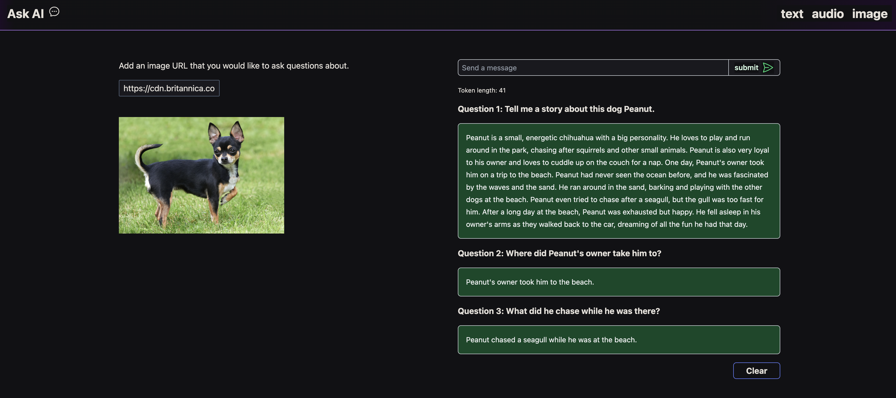

# AI-Powered-App



This is a project that demonstrates how to use several AI technologies:

- OpenAI chat completion API
- Deepgram speech-to-text API
- Replicate API to run the miniGPT vision encoder model
- gpt-3-encoder package to tokenize strings into tokens (which are used to set limits on the length of prompts sent to OpenAI)
- Langchain model, chain, and memory interfaces

## Get it Working

To see this project working, you can clone the project and then do the following.

### Install dependencies

```
npm install
```

### Create .env file

Create a `.env` file at the root of the project and then go into the `.gitignore` file and add `.env` to the list. This will make sure that the `.env` file does not get pushed up to github if you choose to push the project up to github.

## API Keys

Add API keys to the `.env` file as you see in the `.env-example` file. Go to each of these websites to sign up for an API key:

[OpenAI](https://platform.openai.com/signup)

[Deepgram](https://dpgr.am/deepgram-signup)

[Replicate](https://replicate.com/)

### Run the web server and the node server

```
npm run start
```

### To see the Langchain features, switch to the `langchain` branch

```
git checkout langchain
```

### To see the starter code before the features have been added, switch to the `starting-code` branch

```
git checkout starting-code
```

### To see starting code and ending code for each chapter, switch to the chapter number + "start" or "end"

```
git checkout 03-start
git checkout 03-end
```

### Questions

If you have any questions, you can reach out to me on [twitter](https://twitter.com/sandra_rodgers_)
